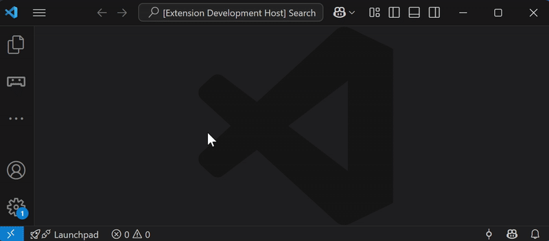

# Pybricks Hub Commander for VSCode

A Visual Studio Code extension to interact with LEGO® Hubs running the Pybricks firmware, inspired by [dusongpei](https://github.com/dsp05/pybricks-vscode)'s work.

## Features

Streamline your Pybricks coding experience with:

- **Connect/disconnect your Hub** via Bluetooth
- **Start/stop programs** directly from VS Code
- **Compile and upload Python scripts** from your workspace
- **View compilation and runtime errors** in your code
- **Auto-connect** to the last used hub
- **Auto-start** your script on save
- **Open and convert** majority of the LEGO robotics file formats
- **Receive program status** and **display hub output messages**

## Getting Started

1. **Install** this extension from the [VS Code Marketplace](#).
2. **Connect** your LEGO Hub via Bluetooth.
3. **Open** your Python or LEGO robotics files.
4. **Use** the command palette (`Ctrl+Shift+P`) to access Pybricks commands.

## Supported LEGO File Formats

This extension opens, displays, analyzes, and converts most major LEGO robotics file formats for easy onboarding, backup, and analysis.

### Features for LEGO Files

- Pseudocode representation of block programs
- Graphical preview of block-based code
- Module dependency visualization of code structure
- Convert block code to compatible Pybricks Python code*

*Experimental: Please verify converted code and provide feedback.

### Platforms & File Types

**SPIKE Prime / Essentials / Robot Inventor:**

SPIKE Prime ([45678](https://www.lego.com/en-us/product/lego-education-spike-prime-set-45678)) and SPIKE Essentials ([45345](https://www.lego.com/en-us/product/lego-education-spike-essential-set-45345)) kit and Robot Inventor ([51515](https://www.lego.com/en-us/product/robot-inventor-51515)) kit for **word-blocks** and **icon-blocks**.

- SPIKE v2 (`.llsp`) and v3 (`.llsp3`)
- Robot Inventor (`.lms`)

**EV3 Mindstorms:**

LEGO® MINDSTORMS® EV3 ([31313](https://www.lego.com/en-us/product/lego-mindstorms-ev3-31313)) **graphical-blocks** and **compiled-binary**.

- EV3 Classroom (`.lmsp`)
- EV3 Lab (`.ev3`)
- EV3 iPad (`.ev3m`)
- EV3 Lab Compiled Binary (`.rbf`)

**Pybricks Python:**

- Pybricks Python (`.py`), supports multiple files.

## Limitations

- Only custom modules in the same folder as the main script are supported
- Package structures and relative imports are **not** currently supported
- Runtime error locations may be inaccurate after changing tabs

## Acknowledgements

This project is rooted on the work of Song-Pei Du [dusongpei](https://github.com/dsp05/pybricks-vscode) and on the work of the [Pybricks authors](https://github.com/pybricks), Laurens Valk and David Lechner.

## License

This project is licensed under the [MIT License](LICENSE).

<!-- ## Screenshot

 -->
